# Pycro-manager Focus Stabilization Guide

## 1. Introduction

This guide provides step-by-step instructions for using the `miEye module` together with `Pycro-manager` (Micro-Manager) to achieve real-time focus stabilization.

The system is composed of an objective mounted on a piezo stage and a CMOS camera positioned along an NIR optical path.

- For total internal reflection (TIR) enabled microscopes, an NIR beam is configured in a back-reflection setup, where the lateral displacement of the beam on the CMOS sensor is used to detect and correct z-drift for precise focus stabilization.

- While microEye natively supports a limited selection of piezo stages and CMOS cameras, integrating it with Micro-Manager via Pycro-manager expands compatibility and enables software-based focus stabilization for a broader range of hardware.

> If TIR or NIR back-reflection is not feasible, the `microEye` and `Pycro-manager` integration aims to support several alternative focus stabilization modalities  (e.g., NIR Fiducial Markers). These can be tailored based on one's microscope configuration, sample type, or specific experimental requirements.

<!-- add table of contents -->

## 2. Table of Contents

- [Pycro-manager Focus Stabilization Guide](#pycro-manager-focus-stabilization-guide)
  - [1. Introduction](#1-introduction)
  - [2. Table of Contents](#2-table-of-contents)
  - [3. microEye Launcher](#3-microeye-launcher)
    - [Usage](#usage)
    - [Terminal](#terminal)
  - [4. Running the miEye Software](#4-running-the-mieye-software)
  - [5. Micro-Manager Configuration](#5-micro-manager-configuration)
  - [6. Enabling the Pycro-manager Server](#6-enabling-the-pycro-manager-server)
    - [Single Micro-Manager Instance](#single-micro-manager-instance)
    - [Multiple Micro-Manager Instances](#multiple-micro-manager-instances)
    - [Launching a Headless Micro-Manager Instance](#launching-a-headless-micro-manager-instance)
  - [7. Starting a Bridge to Micro-Manager Core](#7-starting-a-bridge-to-micro-manager-core)
  - [8. Adding a Micro-Manager Device](#8-adding-a-micro-manager-device)
    - [Adding the Z-Stage](#adding-the-z-stage)
    - [Adding the NIR Camera](#adding-the-nir-camera)
  - [9. Focus Stabilization Control](#9-focus-stabilization-control)
    - [NIR back-reflected beam configuration](#nir-back-reflected-beam-configuration)
    - [NIR Fiducial Markers configuration](#nir-fiducial-markers-configuration)
  - [Optical Schemes](#optical-schemes)
    - [NIR Back-Reflected Beam](#nir-back-reflected-beam)
    - [NIR Fiducial Marker Scheme](#nir-fiducial-marker-scheme)
    - [Other Focus Stabilization Modalities](#other-focus-stabilization-modalities)

## 3. microEye Launcher

The microEye Launcher allows you to launch either the `miEye Module` or the `Viewer Module`, and provides options to select the Qt API and theme for the application.


### Usage

Upon running the launcher, you will be presented with the following interface:

- **miEye Module**: Launches the miEye module for microscope control and acquisition.
- **Viewer Module**: Launches the viewer module for image/data anlysis and visualization.
- **QT API (dropdown)**: Select the Qt API to use. Options are PySide6, PyQt6, or PyQt5.
- **Theme (dropdown)**: Select the theme for the application. Options are None (default), qdarktheme, or qdarkstyle.

To launch a module, simply click on the respective button (`miEye Module` or `Viewer Module`). If you wish to change the Qt API or theme, select the desired option from the dropdown menus before launching.

### Terminal

```powershell
   usage: microEye.exe [-h] [--module MODULE] [--QT_API QT_API] [--theme THEME]

   optional arguments:
    -h, --help            show this help message and exit
    --module {mieye,viewer}
                          The module to launch [mieye|viewer], If not specified, launcher is executed.
    --QT_API {PySide6,PyQT6,PyQt5}
                          Select QT API [PySide6|PyQT6|PyQt5], If not specified, the environment variable QT_API is used.
    --theme {None,qdarktheme,qdarkstyle,...}
                          The theme of the app, if not specified, the environment variable MITHEME is used.
```

You can use the terminal as an alternative to the GUI launcher for launching the microEye application and its modules. The terminal provides the same functionality as the GUI launcher but allows you to specify options directly through command-line arguments. For example:

- To launch the `miEye module`, you can run:

   ```PowerShell
   microEye --module mieye
   ```

- To specify additional options like the Qt API or theme, you can include them as arguments:

   ```PowerShell
   microEye --module mieye --QT_API PySide6 --theme qdarktheme
   ```

## 4. Running the miEye Software

To run the application from a terminal:

1. Open the Command Prompt (CMD) by pressing `Win + R`, typing `cmd`, and pressing `Enter`.
2. There are two ways to launch the `miEye module` application:

   A) Directly from the terminal, use the following command:

   ```PowerShell
   microEye --module mieye
   ```

   B) Alternatively, you can start the application using the microEye Launcher:

   ```PowerShell
   microEye
   ```

   

## 5. Micro-Manager Configuration

Ensure you have a Micro-Manager configuration prepared for focus stabilization. There are few possible scenarios:

1. **Controlling Both Z-Piezo and CMOS via Micro-Manager:**  
   Since a Micro-Manager instance typically manages a single acquisition camera, you will need to create an additional configuration and launch a separate instance for the NIR CMOS and piezo stage.

2. **Controlling the Z-Piezo with one Micro-Manager instance and the CMOS camera with another:**  
   This approach is helpful if you do not have a dedicated Z-Piezo controller and require XYZ stage control in your main Micro-Manager instance. In this case, use your primary instance for stage control and create an additional Micro-Manager instance configured only with the CMOS camera.

3. **Controlling Only the Z-Piezo via Micro-Manager:**  
   If your CMOS camera is natively supported by microEye, you can use your existing Micro-Manager configuration and instance to control just the Z-Piezo, while microEye handles the CMOS camera directly.

## 6. Enabling the Pycro-manager Server

### Single Micro-Manager Instance

Open Micro-Manager, go to `Tools > Options...`, and enable the option `Run pycro-manager server on port 4827`. This allows Pycro-manager to communicate with your Micro-Manager instance.

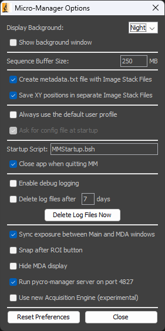

### Multiple Micro-Manager Instances

Since only one Micro-Manager instance can run the pycro-manager server on the default port (4827):

- Use the standard GUI instance for one device (e.g., Z-Piezo or CMOS).

- For the second device, launch a headless Micro-Manager instance using microEye's `Micro-Manager Headless Manager` feature.

This setup enables simultaneous control of multiple devices through separate Micro-Manager instances.

### Launching a Headless Micro-Manager Instance

1. Open the `miEye module` and navigate to `Tools > Micro-Manager Headless Manager`.

   

2. Click on `Add Instance`. In the dialog that appears, specify the parameters for the headless instance, including the configuration file to use. If you are running a GUI instance simultaneously, be sure to set a different port number. Click "OK" to launch the headless instance.

   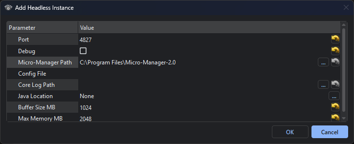

3. The `Micro-Manager Headless Manager` window will display all active headless instances. Here, you can view instance details or stop any running instance as needed.

   

## 7. Starting a Bridge to Micro-Manager Core

To establish a bridge connection to a Micro-Manager Core instance using the `miEye module`, follow these steps:

1. In the `miEye module`, go to `Tools > Micro-Manager Core Bridges`. This section allows you to manage all active bridge connections.

   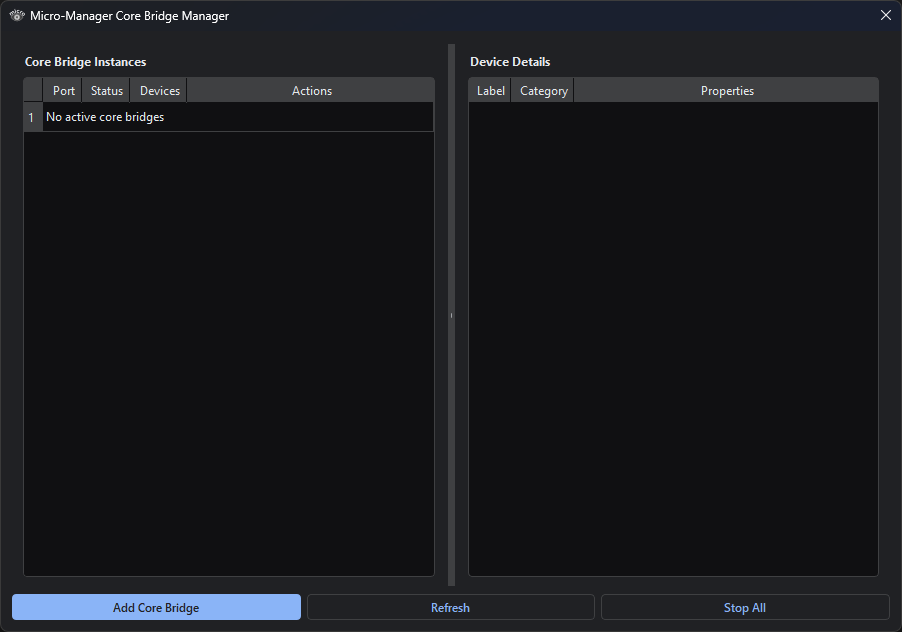

2. Click `Add Core Bridge`. In the dialog that appears, enter the port number for the Micro-Manager Core instance you wish to connect to.

   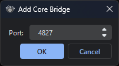

3. Once the connection is established, selecting a bridge from the list will display detailed information about the connected devices on the right-hand side.

   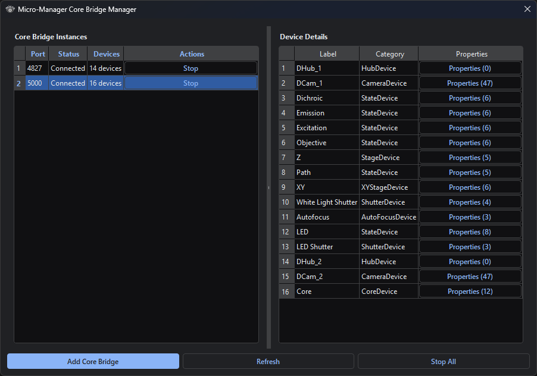

## 8. Adding a Micro-Manager Device

### Adding the Z-Stage

1. After establishing the bridge connection, navigate to the `Devices` tab in the `miEye module`. From the dropdown menu, select `Pycromanager ZStage` and click `Set Stage`.

   

2. In the dialog that appears, select the appropriate bridge instance port from the dropdown list for the `Z-Stage`.

   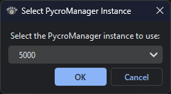

   > **Note:** If only one bridge is active, it will be selected automatically and the port selection dialog will not appear.

3. If the stage is added successfully, a new `Z-Stage` tab will appear in the `miEye module`, displaying the name of the connected stage.

   

### Adding the NIR Camera

1. Once the bridge connection is established, go to the `Cameras List` in the `miEye module` and click `Refresh List` to update the available cameras.

   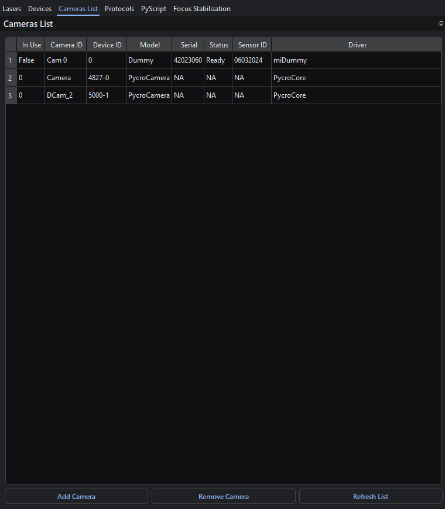

2. From the refreshed list, select the desired camera and click the `Add Camera` button. In the dialog that appears, choose `Autofocus IR` and confirm by clicking `OK`.

   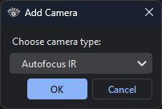

3. A new tab, labeled with the camera device name, will appear. Switch to this tab and click `Freerun` to begin live image acquisition.

   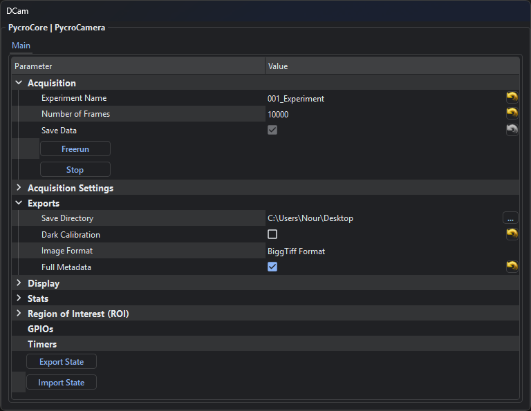

## 9. Focus Stabilization Control

Once the NIR camera and Z-stage are configured, you can enable and control focus stabilization within the `miEye module`.

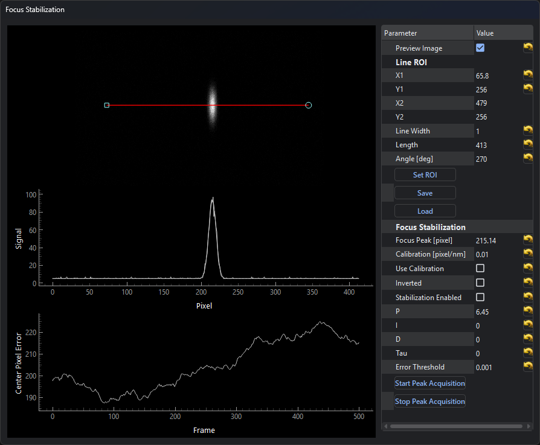

1. Go to the `Focus Stabilization` tab in the `miEye module`.
2. The interface displays three plots:

   - the top shows the live NIR camera feed;
   - the middle displays the linear ROI profile with its Gaussian fit;
   - and the bottom displays the Gaussian center position over the last 500 frames.

3. Center the Z-Piezo within its range.

### NIR back-reflected beam configuration

1. Place a sample on the microscope (e.g., TetraSpeck beads or a dye sandwich) and bring it into focus.

2. Adjust the linear ROI (size, length, angle) using its handles so it follows the path of the NIR beam as the stage is moved several micrometers above and below focus.

   > You can export or import ROI settings as needed.

3. Set the NIR camera framerate to approximately 15 Hz and adjust the exposure time to avoid saturating the detector.
4. If the linear ROI profile appears noisy, increase the `Line Width` of the ROI to reduce noise.
5. To lock focus, enable the `Stabilization Enabled` option in the right-hand panel.

   > If stabilization fails (e.g., rapid sample drift out of focus), try inverting the ROI by selecting the `Inverted` checkbox.

6. Fine-tune the PID control parameters to suit your system.
    - In most NIR back-reflected beam setups, adjusting the `P` (proportional) coefficient is usually sufficient.
    - You may also need to modify the `Error Threshold` to achieve optimal stabilization performance.
7. Continuously monitor the live feedback to optimize stabilization performance. Test the system by applying intentional 1-micrometer Z or XY steps and observe how quickly the sample returns to focus. Use the peak position history plot to identify any overshoot, oscillations, slow response, or failure to maintain focus.

   > **Note:** For optimal sensitivity, adjust your magnification and TIR angle so that the NIR beam peak position shifts by approximately 20–80 nm per pixel.

### NIR Fiducial Markers configuration

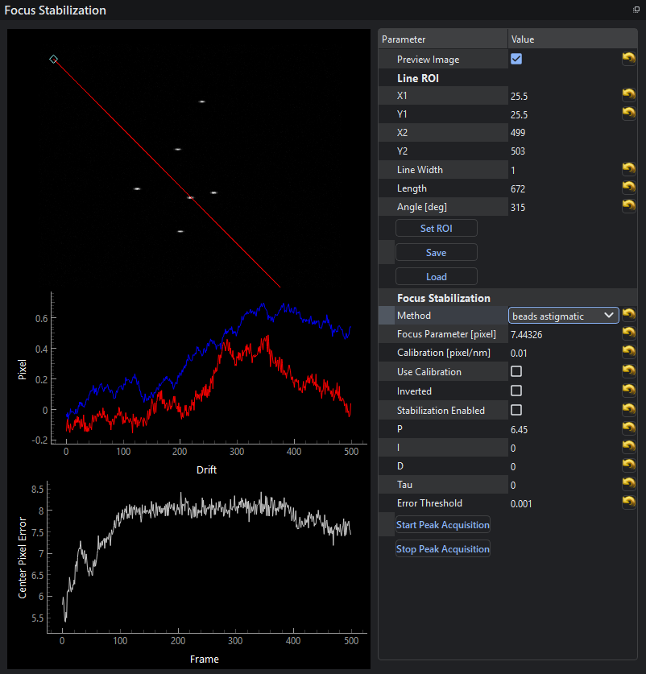

1. Place a sample containing NIR fiducial markers on the microscope and bring it into focus.

2. Adjust the linear ROI (size, length, and angle) using its handles so that it encompasses the desired field of view or region containing the fiducial markers.

   > You can export or import ROI settings as needed.

3. Set the NIR camera framerate to 20 Hz and adjust the laser power to achieve the desired signal-to-noise ratio (SNR).

4. In the focus stabilization settings, change the method from the default `reflection` to `beads astigmatic`.

5. To lock focus, enable the `Stabilization Enabled` option in the right-hand panel.

   > If stabilization fails (e.g., rapid sample drift out of focus), try inverting the ROI by selecting the `Inverted` checkbox.

6. Fine-tune the PID control parameters to suit your system.

> **Notes:**
>
> - This method relies on introducing astigmatism to resolve axial position, thereby eliminating directional ambiguity during focus stabilization.
> - The focus parameter is the average sigma squared difference.
> - Lateral (XY) drift is also measured and visualized in the middle plot, providing real-time feedback on sample stability.

## Optical Schemes

This section outlines the optical configurations supported or planned for microEye focus stabilization.

### NIR Back-Reflected Beam

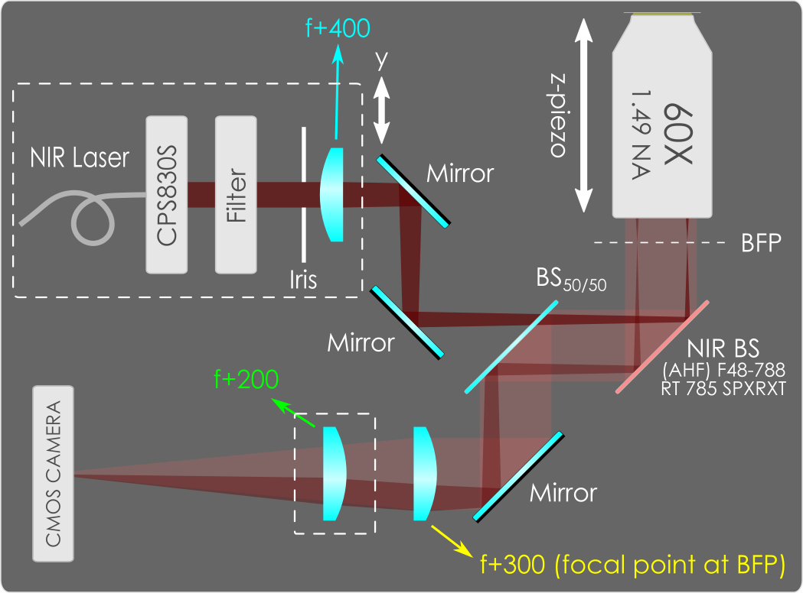

> **Notes:**
>
> - The 200 mm lens can be removed to directly image the sample plane. When included, it is intentionally set slightly out of focus to enhance sensitivity as an alternative to changing the magnification.
> - The schematic is simplified and intended for illustrative purposes only.

### NIR Fiducial Marker Scheme


> **Notes:**
>
> - The excitation scheme is not shown; fiducials should be excited using available suitable lasers.
> - The 300 mm lens can be swapped to adjust the image magnification and sampling, depending on your camera’s pixel size and desired projected pixel size.
> - The schematic is simplified and intended for illustrative purposes only.

### Other Focus Stabilization Modalities

> *Content to be added in a future update. Additional optical schemes and methods will be described here as they become available.*
